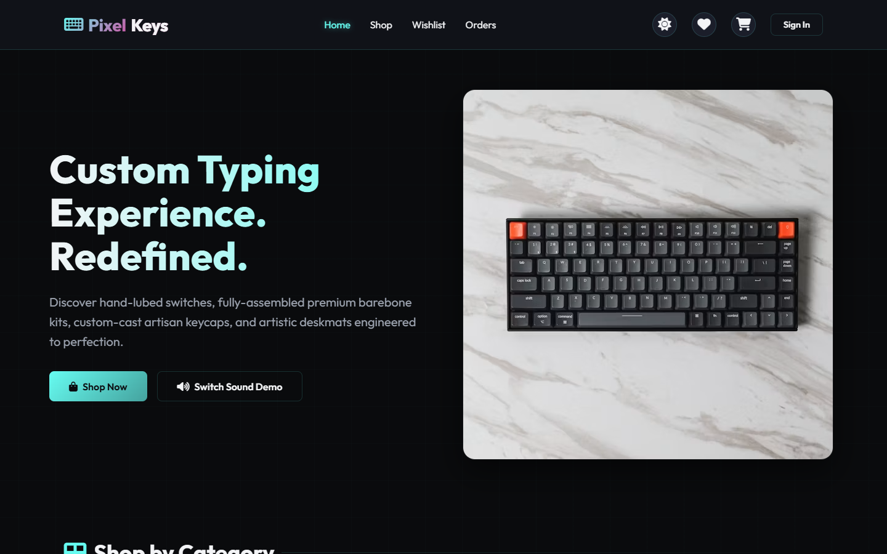
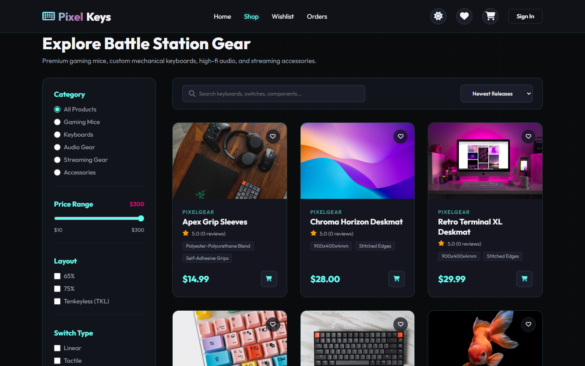

<div align="center">

# 🕹️ PixelGear
### *Premium E-Sports Gaming Accessories & Custom Gear E-Commerce*

[](https://opensource.org/licenses/MIT)
[](https://nodejs.org/)
[](https://github.com/nodkz/mongodb-memory-server)

<br>

| 🏠 Home Page Interface | 🛍️ Shop Product Grid |
| :---: | :---: |
|  |  |

<br>

*A high-performance, glassmorphic, e-sports gaming accessories web application. Ready to run out of the box with zero installation prerequisites.*

</div>

---

## 💎 Features & Highlights

### ⚡ Developer Sandbox Fallback
If no local MongoDB connection is found, the server automatically spawns an **in-memory database instance** (`mongodb-memory-server`) in less than 2 seconds, seeds default gaming gear catalogs, and starts without throwing any timeout errors. **Run the entire app with a single command!**

### 🎹 Interactive Keyboard Customizer
Features an **interactive sound board synthesizer** on the home page powered by the browser's native **Web Audio API**. Test linear (thocky), tactile (pop), and clicky sound profiles dynamically via keyboard presses or mouse clicks!

### 🎨 Premium Glassmorphism UI
A gorgeous cyberpunk blueprint theme with glowing grid backdrops, subtle hover animations, dynamic magnifying glass zooms on product viewports, and custom scrollbars. Includes a responsive dark/light mode toggle with smart color-variable headers.

### 💳 Complete Checkout & Order Management
Full-stack shopping cart, saved-for-later queues, wishlist bookmarks, profile management, and a mock Stripe payment flow that connects and generates order invoices.

### ⚙️ Rich Admin Controls
A statistics-packed admin panel displaying real-time store metrics (revenue, orders, items) and complete CRUD interfaces to add, edit, or delete catalog listings directly from the dashboard.

---

## 🎁 Benefits

* **No Prerequisites**: Zero MongoDB installations, docker containers, or local database configurations needed to run. Run `npm start` and play!
* **Aesthetic First**: Built to stand out with customized CSS variables, Outfit/Inter typography, and vibrant gradients rather than generic framework templates.
* **Tested & Reliable**: Equipped with a full integration test suite confirming connection, authentication, shopping cart edits, and checkouts.
* **Modern API**: Standard MVC structure using Express, JWT tokens, secure HTTP cookies, and robust schema validation.

---

## 🛠️ Technology Stack

| Layer | Technology |
| :--- | :--- |
| **Frontend** | HTML5, CSS3 (Vanilla Custom System), JavaScript (ES6 Modules) |
| **Backend** | Node.js, Express.js |
| **Database** | MongoDB & Mongoose ORM |
| **In-Memory fallback** | `mongodb-memory-server` (Mongoose v4.4.25 fallback wrapper) |
| **Auth & Security** | JSON Web Tokens (JWT), Cookie Parser, Bcrypt, Helmet |
| **Payments** | Stripe (Mock & Live Test modes) |

---

## 🚀 Quick Start Guide

### 1. Install Dependencies
```bash
npm install
```

### 2. Start the Application
Run the start script. The application will check for local MongoDB, boot the in-memory fallback, seed default user accounts, and start the server:
```bash
npm start
```
Open **[http://localhost:3000](http://localhost:3000)** in your browser!

### 3. Run Integration Tests
```bash
npm run test
```

---

## 🔑 Default Test Profiles
Use these preloaded credentials to explore customer and administrator features:

* **Customer Account**: `customer@pixelgear.com` / `customer123`
* **Admin Account**: `admin@pixelgear.com` / `admin123`
